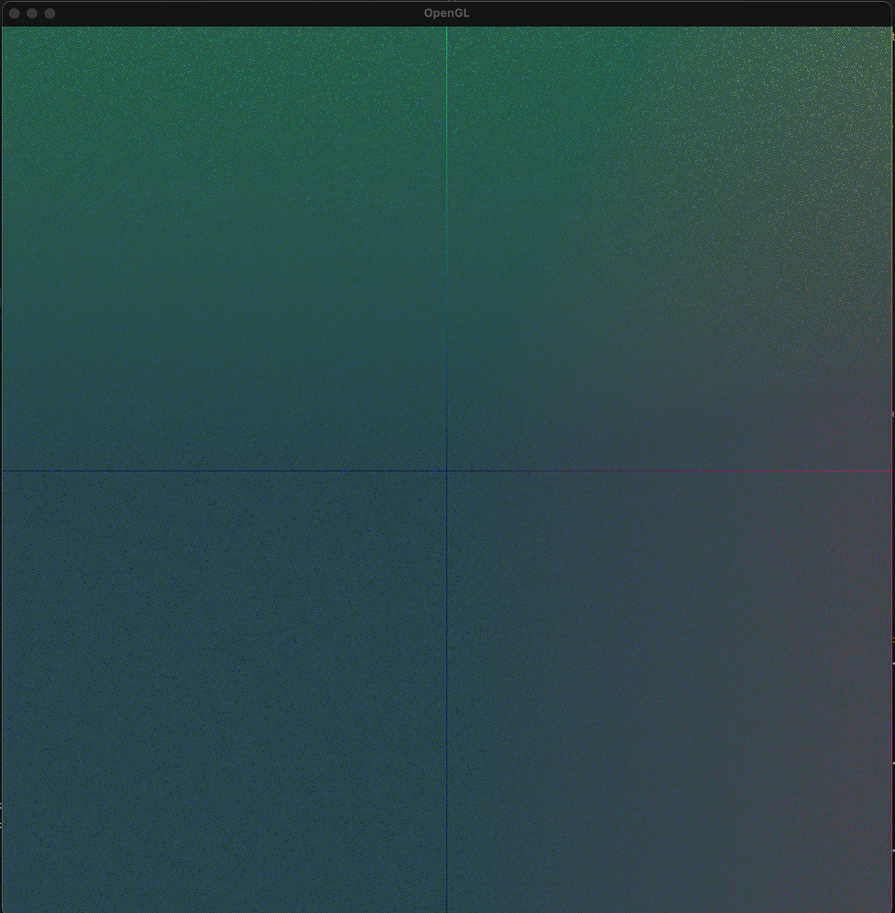

## What is it?

This repository contains a working example of OpenGL on a Mac M1. 
It demonstrates how to:

- Load vertex, geometry, and fragment shaders
- Generate fake data
- Apply the shaders to render a simple scene

## Side notes

Please note that this project has only been tested on a Mac M1.
GLFW binaries are included here.

## Get started

To run the example, simply execute `make run` in your terminal. 

You should see a window displaying a scene where the color of each vertex depends on its position

## Side notes

This project has only been run on a Mac M1.